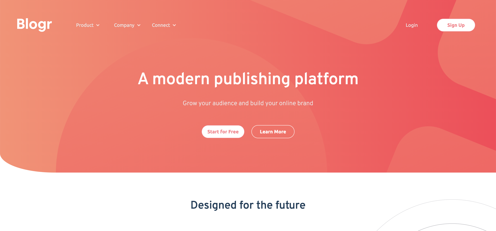

# Frontend Mentor - Blogr landing page solution

This is a solution to the [Blogr landing page challenge on Frontend Mentor](https://www.frontendmentor.io/challenges/blogr-landing-page-EX2RLAApP). Frontend Mentor challenges help you improve your coding skills by building realistic projects. 

## Table of contents

- [Overview](#overview)
  - [The challenge](#the-challenge)
  - [Screenshot](#screenshot)
  - [Links](#links)
- [My process](#my-process)
  - [Built with](#built-with)
  - [What I learned](#what-i-learned)
  - [Continued development](#continued-development)
- [Author](#author)

## Overview

### The challenge

Users should be able to:

- View the optimal layout for the site depending on their device's screen size
- See hover states for all interactive elements on the page

### Screenshot

### Links

- Solution URL: [https://www.frontendmentor.io/solutions/blog-page-using-only-html-css-and-js-P6xwbr_q-](https://www.frontendmentor.io/solutions/blog-page-using-only-html-css-and-js-P6xwbr_q-)
- Live Site URL: [https://sad-kepler-121164.netlify.app](https://sad-kepler-121164.netlify.app)

## My process

### Built with

- Semantic HTML5 markup
- CSS custom properties
- Flexbox
- Javascript

### What I learned

With this project I had the chance to apply my knowledge and create a blog page using only CSS, HTML and Javascript, which I hadn't made in a while.

### Continued development

The topics which I think I cana improve is how to deal with background images and position relative, where and how to apply them more efficiently. 

## Author

- LinkedIn - [Margarida Sousa](https://www.linkedin.com/in/margaridabsousa)
- Frontend Mentor - [@MargSousa](https://www.frontendmentor.io/profile/yourusername)
